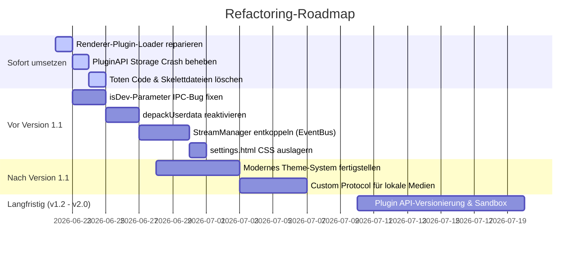

# Architektur- und Wartbarkeitsanalyse - WebRadio

Dieses Dokument enthält eine umfassende technische Analyse der WebRadio-Codebasis vor dem geplanten Umbau. Es bewertet das Risiko für die langfristige Wartbarkeit (2–3 Jahre) unter Einbeziehung von Plugins, Themes und künftigen Erweiterungen.

---

## Architektur-Risiken

### 1. Stumme Systemfunktion: Defekter Renderer-Plugin-Loader
* **Priorität**: Hoch
* **Betroffene Dateien**: [RendererPluginManager.js](file:///d:/Development/Source/Javascript/Sicherung/renderer/plugins/RendererPluginManager.js)
* **Problem**: 
  Die Funktion `loadRendererPlugins()`, die installierte Renderer-Scripts lädt und auf Toggles reagiert, wird nirgends im Code aufgerufen oder importiert. Renderer-Erweiterungen (z. B. der Notification-Toast von `discordRPC`) werden daher stumm ignoriert und niemals ausgeführt.
* **Verbesserungsvorschlag**: 
  Aufruf von `loadRendererPlugins()` beim App-Bootstrap in [renderer.jsx](file:///d:/Development/Source/Javascript/Sicherung/renderer/renderer.jsx) integrieren.
* **Bewertung**:
  - **Wartbarkeitsgewinn**: Hoch (stellt die grundlegende Funktionalität des Plugin-Systems im UI her)
  - **Komplexitätszunahme**: Keine (die Funktion existiert bereits vollständig)
  - **Aufwand**: Extrem gering (1 Zeile Code)
  - **Empfehlung**: Ja (Sofort umsetzen)

---

### 2. Runtime-Crash in der Plugin-Speicher-API
* **Priorität**: Hoch
* **Betroffene Dateien**: [PluginAPI.js](file:///d:/Development/Source/Javascript/Sicherung/electron/core/plugins/PluginAPI.js)
* **Problem**: 
  Die Datei importiert das Storage-Modul unter dem Namen `PluginStorage` (`const PluginStorage = require("./PluginStorage")`), greift aber in den Funktionen `exists()`, `get()`, `set()` und `remove()` auf ein nicht deklariertes Symbol namens `storage` zu (z. B. `storage.read(...)`). Sobald ein Plugin versucht, Daten zu speichern oder zu lesen, stürzt der Electron-Hauptprozess mit einem `ReferenceError: storage is not defined` ab.
* **Verbesserungsvorschlag**: 
  Korrigieren des Imports auf `const storage = require("./PluginStorage");`.
* **Bewertung**:
  - **Wartbarkeitsgewinn**: Hoch (beseitigt einen fatalen Absturz-Bug)
  - **Komplexitätszunahme**: Keine
  - **Aufwand**: Extrem gering
  - **Empfehlung**: Ja (Sofort umsetzen)

---

### 3. Falscher Umgebungsparameter bei der IPC-Registrierung (isDev-Bug)
* **Priorität**: Hoch
* **Betroffene Dateien**: [registerIpcHandlers.js](file:///d:/Development/Source/Javascript/Sicherung/electron/core/ipc/registerIpcHandlers.js) / [themeHandlers.js](file:///d:/Development/Source/Javascript/Sicherung/electron/core/ipc/themeHandlers.js)
* **Problem**: 
  In `registerAllIpc(window)` wird die Instanz von `WindowManager` übergeben. In `themeHandlers.js` lautet der Parameter jedoch `isDev`. Da das übergebene Manager-Objekt stets "truthy" ist, arbeitet das Theme-System in der gebauten App (Produktion) fälschlicherweise immer im Entwicklungsmodus. Dies führt zu Pfadfehlern, da Themes unter `../../../themes` statt unter `process.resourcesPath` gesucht werden.
* **Verbesserungsvorschlag**: 
  Registrierung umstellen, sodass der `WindowManager` sauber übergeben wird. Die Bestimmung von `isDev` sollte intern über eine globale Konstante oder über `app.isPackaged` erfolgen.
* **Bewertung**:
  - **Wartbarkeitsgewinn**: Hoch (verhindert schwer lokalisierbare Pfadfehler im Build)
  - **Komplexitätszunahme**: Keine
  - **Aufwand**: Gering
  - **Empfehlung**: Ja (Vor Version 1.1 umsetzen)

---

### 4. Code-Leichen und doppelte Verantwortlichkeiten (Skelettdateien)
* **Priorität**: Mittel
* **Betroffene Dateien**: 
  - `electron/core/plugins/PluginLoader.js`
  - `electron/core/plugins/PluginManager.js`
  - `electron/core/plugins/PluginPermissions.js`
  - `electron/core/plugins/PluginService.js`
  - `electron/core/plugins/PluginEvents.js`
  - [main.legacy.js](file:///d:/Development/Source/Javascript/Sicherung/electron/main.legacy.js)
  - `electron/core/events/EventBus.js` (leere Datei)
* **Problem**: 
  Diese Dateien enthalten unvollständige Skelette (z. B. leere Klassen), falsche Pfade (z. B. `manifesst.json` mit Tippfehler) oder sind komplett funktionslose Duplikate bereits existierender Module (wie das aktive `pluginManager.js` unter `electron/plugins/`). `main.legacy.js` ist ein verwaistes 300-Zeilen-Relikt der alten monolithischen Struktur.
* **Verbesserungsvorschlag**: 
  Konsequentes Löschen dieser verwaisten Dateien, um Verwirrung zu vermeiden und die Codebasis sauber zu halten.
* **Bewertung**:
  - **Wartbarkeitsgewinn**: Hoch (Clean Code, verhindert Fehl-Imports)
  - **Komplexitätszunahme**: Keine (Reduzierung)
  - **Aufwand**: Gering
  - **Empfehlung**: Ja (Sofort umsetzen)

---

### 5. Enge Kopplung: StreamManager direkt an BrowserWindow gebunden
* **Priorität**: Mittel
* **Betroffene Dateien**: [streamManager.js](file:///d:/Development/Source/Javascript/Sicherung/electron/core/audio/streamManager.js) / [radioHandlers.js](file:///d:/Development/Source/Javascript/Sicherung/electron/core/ipc/radioHandlers.js)
* **Problem**: 
  Der `StreamManager` hält eine direkte Referenz auf `mainWindow` und sendet Audiodaten (PCM-Chunks und Metadaten) hartkodiert über `webContents.send("radio:pcm", ...)` an dieses eine Fenster. Wird das Hauptfenster geschlossen, neu erstellt oder um ein zweites UI-Fenster (z. B. Equalizer) ergänzt, führt dies zu Stabilitätsproblemen. Zudem erschwert dies automatisierte Audio-Tests ohne GUI-Kontext.
* **Verbesserungsvorschlag**: 
  Der `StreamManager` sollte PCM- und Metadaten-Pakete über den internen `eventBus` emittieren. Das IPC-Modul `radioHandlers.js` lauscht auf diese Events und schickt sie an das jeweils aktive Fenster.
* **Bewertung**:
  - **Wartbarkeitsgewinn**: Hoch (vollständige Entkopplung der Audio-Engine von der UI)
  - **Komplexitätszunahme**: Gering
  - **Aufwand**: Mittel
  - **Empfehlung**: Ja (Vor Version 1.1 umsetzen)

---

### 6. Großes CSS-Monolith eingebettet in settings.html
* **Priorität**: Mittel
* **Betroffene Dateien**: [settings.html](file:///d:/Development/Source/Javascript/Sicherung/renderer/settings.html)
* **Problem**: 
  Über 350 Zeilen CSS befinden sich in einem Inline-`<style>`-Block direkt in der HTML-Datei des Einstellungsfensters. Dies erschwert das Syntax-Highlighting, das Caching und die Trennung der Belange (Separation of Concerns).
* **Verbesserungsvorschlag**: 
  Auslagerung des CSS-Blocks in eine eigenständige CSS-Datei `renderer/styles/settings.css` und Einbindung über ein Standard-`<link>`-Tag.
* **Bewertung**:
  - **Wartbarkeitsgewinn**: Mittel (sauberere HTML-Dateien)
  - **Komplexitätszunahme**: Keine
  - **Aufwand**: Gering
  - **Empfehlung**: Ja (Vor Version 1.1 umsetzen)

---

### 7. Kopplung von Themes an das Layout-Design (Layout-CSS in Themes)
* **Priorität**: Niedrig
* **Betroffene Dateien**: [style.css](file:///d:/Development/Source/Javascript/Sicherung/themes/dark/style.css) / [style.css](file:///d:/Development/Source/Javascript/Sicherung/themes/neon/style.css)
* **Problem**: 
  Themes deklarieren nicht nur CSS-Variablen, sondern überschreiben Layout-Elemente wie `.titlebar` (mit fester Höhe, Padding, Flexbox-Regeln). Ändert sich das HTML/React-Layout der App, brechen diese Themes sofort.
* **Verbesserungsvorschlag**: 
  Themes im neuen Standard (`variables.css`) strikt auf das Überschreiben von CSS-Variablen beschränken. Struktur- und Layout-CSS gehört ausschließlich in den Core-Stylesheet `renderer/styles/core.css`.
* **Bewertung**:
  - **Wartbarkeitsgewinn**: Hoch (Themes werden unempfindlich gegenüber UI-Restrukturierungen)
  - **Komplexitätszunahme**: Keine
  - **Aufwand**: Gering
  - **Empfehlung**: Ja (Im Zuge des neuen Theme-Systems umsetzen)

---

### 8. Toter Code für Verzeichnis-Entpackung
* **Priorität**: Mittel
* **Betroffene Dateien**: [depackUserdata.js](file:///d:/Development/Source/Javascript/Sicherung/electron/core/depackUserdata.js)
* **Problem**: 
  Die Implementierung zum Anlegen der Plugin- und Theme-Ordner im UserData-Verzeichnis (`setupUserDirs` und `copyDefaults`) wird nie aufgerufen. Endnutzer können dadurch in gepackten Builds keine eigenen Erweiterungen manuell installieren, obwohl dies im Guide dokumentiert ist.
* **Verbesserungsvorschlag**: 
  Aufruf beim App-Start in [main.js](file:///d:/Development/Source/Javascript/Sicherung/electron/main.js) einbinden.
* **Bewertung**:
  - **Wartbarkeitsgewinn**: Mittel (User-Erweiterbarkeit wird lauffähig)
  - **Komplexitätszunahme**: Niedrig
  - **Aufwand**: Gering
  - **Empfehlung**: Ja (Vor Version 1.1 umsetzen)

---

## Zielarchitektur (Version 1.1 bis 2.0)

Um Overengineering zu vermeiden und die Anwendung bewusst schlank zu halten, wird keine komplexe Dependency-Injection-Bibliothek eingeführt. Wir strukturieren die Ordner so um, dass die Zuständigkeiten eindeutig sind.

### Vorgeschlagene Verzeichnisstruktur

```txt
electron/
├─ core/
│  ├─ app/                 # Lifecycle & Window Management
│  │  ├─ WindowManager.js  # Koordiniert alle Fenster
│  │  ├─ MainWindow.js     # Definition Hauptfenster
│  │  └─ SettingsWindow.js # Definition Einstellungsfenster
│  ├─ audio/               # Reine Audio-Engine (ohne UI-Bezug)
│  │  ├─ ffmpeg-resolver.js
│  │  ├─ metadataParser.js
│  │  └─ streamManager.js  # Emittiert PCM & Metadata über EventBus
│  ├─ eventBus.js          # Zentraler, entkoppelter EventBus
│  ├─ ipc/                 # IPC-Handler (Reine Router / Dispatcher)
│  │  ├─ registerIpcHandlers.js
│  │  ├─ pluginHandlers.js
│  │  ├─ radioHandlers.js  # Brücke zwischen StreamManager (Events) und UI (send)
│  │  ├─ storageHandlers.js
│  │  ├─ themeHandlers.js
│  │  ├─ updaterHandlers.js
│  │  └─ windowHandlers.js
│  ├─ storage/             # Datenhaltung & Konfiguration
│  │  └─ storage.js
│  ├─ themes/              # Theme-Logik
│  │  ├─ ThemeLoader.js    # Scannt fs, validiert theme.json, Pfad-Normalisierung
│  │  └─ ThemeManager.js    # Verwaltet aktiven Status, triggert IPC-Updates
│  ├─ system/              # Native System-Features
│  │  ├─ mediaKeys.js
│  │  └─ tray.js
│  └─ updater/             # Update-Logik
│     └─ updater.js
├─ plugins/                # Core-Plugin-System
│  ├─ pluginManager.js     # Lädt Node-Plugins
│  └─ PluginStorage.js     # Sandboxed Storage für Plugins
├─ main.js                 # Minimaler Bootstrapper (Entry Point)
└─ preload.js              # Sichere ContextBridge APIs
```

---

## Refactoring-Roadmap



### 1. Sofort umsetzen
1. **Renderer-Plugin-Loader reparieren**: Einbindung in `renderer.jsx`, um Renderer-Plugins sofort wieder lauffähig zu machen.
2. **PluginAPI-Bug beheben**: Deklarationsfehler von `storage` korrigieren, um Abstürze zu verhindern.
3. **Aufräumen**: Löschen der leeren und funktionslosen Skelettdateien aus `electron/core/plugins/` sowie der alten `main.legacy.js`.

### 2. Vor Version 1.1
1. **isDev-Bug beheben**: Falsche Parameterübergabe in `registerAllIpc` korrigieren.
2. **StreamManager entkoppeln**: Umstellung der PCM/Metadaten-Kommunikation auf ein eventbasiertes Modell über den `eventBus`.
3. **depackUserdata integrieren**: Standardordner beim ersten Start anlegen lassen.
4. **Settings-CSS auslagern**: Sauberkeit der HTML-Datei wiederherstellen.

### 3. Nach Version 1.1 (bis v1.3)
1. **Theme-System-Modernisierung**: Implementierung von `ThemeLoader` und `ThemeManager` basierend auf dem neuen Ordner-Layout.
2. **Custom Protocol**: Registrierung eines `webradio://`-Protokolls zur sicheren, performanten und sandboxed Bereitstellung von Theme- und Plugin-Assets (wie z. B. `preview.png`) ohne Umwege über ungeschützte `file://`-URLs.

### 4. Langfristig (v1.5 - v2.0)
1. **Plugin-API Versionierung**: Einführung eines API-Modells mit Zugriffsschutz und versionierten Berechtigungen (`apiVersion` im Manifest).
