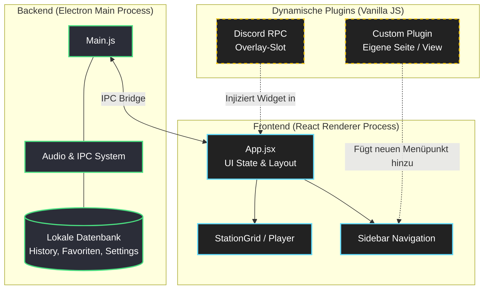

# 📻 WebRadio – Dein ultimatives, plattformübergreifendes Radio-Erlebnis

Willkommen bei **WebRadio** (Version 1.0.5) – einer von Grund auf neu entwickelten, modernen Radio-Applikation von *Your Elite Systems*. Wir haben es uns zur Aufgabe gemacht, das klassische Internetradio ins moderne Zeitalter zu holen. 

Egal, ob du beim Gaming im Hintergrund ungestört Musik hören willst, beim Arbeiten konzentrationsfördernde Beats suchst oder einfach die grenzenlose Vielfalt internationaler Sender durchstöbern möchtest: WebRadio liefert dir kompromisslose Performance in einem atemberaubenden, vollständig anpassbaren Design.

---

## 💻 Die Technologie dahinter (Under the Hood)

WebRadio ist keine simple Webseite in einem Fenster. Es ist eine vollwertige, moderne Desktop-Applikation, gebaut auf einem robusten Tech-Stack:

- **Electron.js:** Bildet das Fundament (den "Main Process"). Es kommuniziert nativ mit deinem Betriebssystem, verwaltet deine lokalen Speicherdaten, den Auto-Updater und native Fensterkontrollen.
- **React 19:** Der "Renderer Process" (die Benutzeroberfläche) wird von der aktuellsten React-Version angetrieben. Das sorgt für blitzschnelle UI-Updates, ohne dass die gesamte App neu laden muss.
- **esbuild:** Ein extrem schneller Bundler kompiliert den React-Code in Millisekunden.
- **Vanilla JavaScript (für Plugins):** Um die Einstiegshürde für Modder so gering wie möglich zu halten, können externe Plugins in purem, einfachem JavaScript geschrieben werden. Sie werden zur Laufzeit dynamisch geladen.

---

## 🧠 Wie die App funktioniert (Die Logik einfach erklärt)

Damit WebRadio so schnell und flexibel bleibt, trennen wir die harte Logik (Audio-Streaming, Daten speichern) strikt vom Aussehen der App (UI). Und genau dazwischen hängen sich die Plugins ein.

Hier ist eine einfache grafische Darstellung der Architektur:



**Was passiert hier genau?**
1. **Das Backend (Electron):** Merkt sich im Hintergrund alles (welchen Sender du geliked hast, wie laut dein Ton ist) und wickelt den echten Audio-Stream ab.
2. **Das Frontend (React):** Zieht sich diese Daten blitzschnell und baut dir das schicke Glassmorphism-Design zusammen, das du auf dem Bildschirm siehst.
3. **Die Brücke (Plugins):** Wenn du z.B. das Discord-Plugin aktivierst, lädt React im laufenden Betrieb ein externes Vanilla-JS Skript. Die "Registry API" der App sagt dem Plugin dann: *"Hier ist ein leerer Platz auf dem Bildschirm (Slot), pack dein Overlay da rein!"* – So kannst du das UI umbauen, ohne den React-Kern anfassen zu müssen!

---

## 🚀 Die Kern-Features im Detail

### 🌍 Grenzenlose Sender-Vielfalt & Smarte Suche
Verabschiede dich von mühsamen Suchen nach Stream-URLs. WebRadio ist direkt an globale Radio-Datenbanken angebunden und liefert dir tausende Sender out-of-the-box.
- **Präzise Filter:** Suche nicht nur nach Sendernamen, sondern filtere gezielt nach **Land** oder **Genre**.
- **Intelligenter Verlauf:** Du hast einen genialen Song gehört, aber den Sendernamen vergessen? Der Verlauf merkt sich immer die letzten Sender.

### 🎨 State-of-the-Art Benutzeroberfläche & Theme-Engine
- **Glassmorphism & Dark Mode:** Standardmäßig kommt die App in einem modernen Dark-Mode mit wunderschönen Milchglas-Effekten, der sich perfekt in jedes moderne Desktop-Setup einfügt.
- **Dynamische Theme-Engine:** Über unsere integrierte Theme-Engine kannst du mit wenigen Klicks komplette CSS-Themes wechseln oder eigene erstellen!

### 🎮 Volle Discord Rich Presence Integration
Für Gamer unverzichtbar: WebRadio spricht nativ mit Discord. 
Sobald du einen Sender startest, aktualisiert das integrierte **Discord RPC Plugin** automatisch deinen Discord-Status in Echtzeit.

### 🔄 Nahtlose Auto-Updates
Ein integrierter Auto-Updater sucht im Hintergrund nach neuen Versionen und übernimmt diese mit einem einzigen Klick.

---

## 💬 Discord-Vorstellung (Fertig formatiert zum Kopieren)

*(Diesen Block kannst du 1:1 kopieren und in Discord-Servern unter #projekte oder #vorstellungen posten)*

```text
**📻 WebRadio v1.0.5 by Your Elite Systems – Next-Gen Internet Radio!**

Schluss mit überladenen Webseiten und langsamen Playern! Wir haben mit **WebRadio** eine komplett neue, ressourcenschonende Desktop-App gebaut. Unter der Haube arbeiten **Electron.js** und **React 19**, um dir blitzschnelle Ladezeiten und ein modernes Glassmorphism-UI zu garantieren.

✨ **Was die App besonders macht:**
> 🌍 **Riesige Datenbank:** Filtere tausende Sender nach Genre oder Land.
> 🎮 **Discord Rich Presence:** Zeig live in deinem Profil, welchen Sender & Song du hörst!
> 🎨 **Theme-Engine:** Komplett anpassbares Design.
> 🧩 **Hybrid-Plugin-System:** Die App ist erweiterbar! Schreibe eigene einfache Vanilla-JS Plugins, die sich dynamisch in den React-Kern einklinken (als Menüpunkte oder Widgets).
> ⭐ **Favoriten & Verlauf:** Speichere Sender mit einem Klick.

Die Architektur trennt das Core-Streaming sauber von der Oberfläche, was Modding extrem einfach macht. Wir suchen immer Leute, die Bock haben, die App mit eigenen Plugins oder Themes zu erweitern!

📥 **Lad dir die aktuelle Version hier runter:**
[Dein Download/GitHub Link hier]

Wir sehen uns im Voice-Chat! 🎧🔥
```

---

## 📥 Links & Community

- 🔗 **Offizielle Website & Download:** [Dein Link hier]
- 🐙 **GitHub (Quellcode / Plugin-Doku):** [Dein GitHub Link hier]
- 💬 **Komm auf unseren Discord:** [Dein Discord Link hier]

Wir freuen uns über euer Feedback, neue Themes, spannende Plugins und natürlich über jeden Bug-Report. Viel Spaß beim Musikhören mit WebRadio! 🎵
